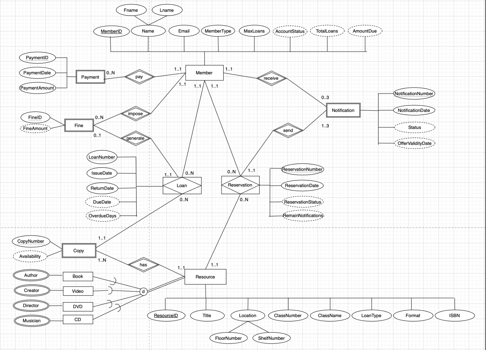

# college-library-system
  
---
## Overview

This project is a database management application developed as part of the Database Design module coursework. It simulates a **College Library System** with functionalities to manage resources, loans, reservations, and fines effectively.

The project involved designing the database schema, normalizing it, and implementing it using **MySQL**. The system supports queries, views, and triggers to handle various library-related operations seamlessly.

---
## Features

- **Database Design**
  - [Conceptual Schema (ER Diagram)](./database-design/er-diagram.png): ER diagram following Chen notation.
  - [Relational Schema](./database-design/relational-schema.pdf): Derived from the ER diagram and normalized to 3NF.
  - [Normalization Documentation](./database-design/normalisation.pdf): Comprehensive documentation of the normalization process.
  - [Data Dictionary](./database-design/data-dictionary.pdf): Description of entities, attributes, and assumptions.

- **Database Implementation**
  - MySQL scripts for:
    - [Create Tables](./sql-scripts/create-tables.sql): Creating tables with primary/foreign key constraints and validation checks.
    - [Triggers](./sql-scripts/triggers.sql): Automation for actions like updating resource availability.
    - [Insert Data](./sql-scripts/insert-data.sql): Populating the database with significant test data.
    - [Create Views](./sql-scripts/create-views.sql): Specialized views tailored for different user groups.
    - [Queries](./sql-scripts/queries.sql): Pre-defined queries for common operations.

---
## Objectives and How They Are Solved

### Objectives
1. **Efficient Resource Management**: Track and manage books, DVDs, CDs, and other resources.
2. **Loan and Reservation Tracking**: Monitor loans, reservations, and overdue items.
3. **Fine Management**: Calculate and track overdue fines and payments.
4. **Demand Analysis**: Identify popular resources to aid library staff in decision-making.
5. **Automated Operations**: Use triggers to ensure real-time updates for availability and fines.

### Solutions
- **Resource Management**:
  - Comprehensive database schema with entities like `Resource`, `Member`, `Loan`, `Reservation`, and more.
  - Each resource is categorized with details such as class, format, and location.

- **Loan and Reservation Tracking**:
  - A normalized schema tracks which resources are loaned or reserved by members.
  - Views provide real-time insights into overdue loans and pending reservations.

- **Fine Management**:
  - A `Fine` table and SQL triggers calculate overdue fines based on days exceeded.

- **Demand Analysis**:
  - Views analyze loan and reservation data to identify high-demand resources.

- **Automated Operations**:
  - Triggers handle updates for resource availability and member status (e.g., suspension due to unpaid fines).

---
## ER Diagram

Below is the ER diagram illustrating the conceptual schema of the database:

---
## Key Outputs: Views and Queries

### Views

### 1. **Popular Resources**
- **Purpose**: This view helps librarians monitor and analyze library services by displaying the number of existing copies, loans, and reservations for each resource. It allows librarians to:
  - Assess the demand for specific resources.
  - Strategically add more copies of high-demand items.
  - Adjust loan periods (e.g., shortening them to 7 days) based on resource usage.


### 2. **Overdue Loans**
- **Purpose**: This view provides real-time monitoring of loan records within the library system. It is primarily used by librarians to:
  - Display details of all loans, including overdue days and loan statuses.
  - Extract overdue days for subsequent fine calculations.
  - Analyze loan trends and ensure timely returns. The view is designed to optimize storage space by calculating derived attributes (e.g., overdue days and loan statuses) dynamically rather than storing them in the database.


### 3. **Pending Reservations**
- **Purpose**: The Member Summary view provides both librarians and members with a detailed overview of member account details. It allows:
  - Librarians to analyze trends in overdue loans and payment history, which may inform decisions like extending loan periods or enforcing stricter policies.
  - Members to track their current account status, including overdue fines, total payments made, and the remaining amount due. This helps promote responsible use of library resources by making members aware of their financial obligations.

---

### Predefined Queries for Common Operations
To facilitate common library operations, a set of predefined queries was created. These queries are designed to streamline routine tasks and provide quick access to frequently needed information. You can find these queries in the file:
[queries](./sql-scripts/queries.sql)
This file contains SQL queries for operations such as:
1. List members with unreturned overdue resources with resource names.
2. Retrieve the top 5 members with the highest number of loans in 2023.
3. Show the location and the number of available copies for a resource.
4. List all CDs in one class (i.e.“Music” class).
5. Find the top 10 borrowed books.
6. Show the resources with no available copies.
7. Retrieve Current Reservations.
8. Display pending reservation notifications for a member (i.e. MemberID=20159029).
9. The query is used by library administrations to monitor and manage member accounts that have been temporarily suspended within the system.
10. Retrieve Reservation for a particular resource (i.e. the resource with the title 'Principles of marketing engineering and analytics').

---
## Installation and Setup

1. **Clone the repository**:
   ```bash
   git clone https://github.com/adinanabi/college-library-system.git
   cd college-library-system
2. **Set up the database**:
  - Run `create-tables.sql` to create the database schema.
  - Populate the database with sample data using `insert-data.sql`.
---
## Usage

After setting up the database, execute the following SQL scripts to utilize the system:
- **Execute SQL scripts**:
- `create-views.sql`: Creates tailored views for different user roles.
- `queries.sql`: Contains 12 pre-defined queries for common operations.
- `triggers.sql`: Automates resource availability updates.

You can run these scripts in your MySQL environment (e.g., MySQL Workbench) to interact with the database and retrieve useful information.

---
## Technologies Used
- Database: MySQL
- Languages: SQL
- Tools: MySQL Workbench, ER diagramming tool

---
## License
This project is for educational purposes and is licensed under the [MIT License](./LICENSE).
